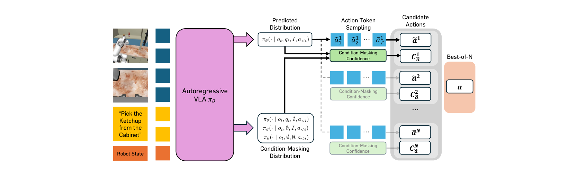

# MG-Select Project Page

Project page for **"Verifier-free Test-Time Sampling for Vision-Language-Action Models"** (ICLR 2026).

📄 [arXiv:2510.05681](https://arxiv.org/abs/2510.05681)

---

## 🚀 GitHub Pages 배포 가이드 (먼저 주소부터 박기)

### 1. GitHub에 repo 생성
먼저 GitHub 계정으로 로그인 후 **새 repo 생성**:
- Repository name: `mg-select`
- Visibility: **Public** (Pages는 public repo여야 무료로 가능)
- "Add a README" 체크 **해제**

### 2. 이 폴더를 push

```bash
# 이 mg-select 폴더 안에서
cd mg-select
git init
git add .
git commit -m "Initial project page"
git branch -M main
git remote add origin https://github.com/suhyeok-jang/mg-select.git
git push -u origin main
```

### 3. GitHub Pages 활성화
1. repo 페이지 → **Settings** → 좌측 메뉴 **Pages**
2. **Source**: `Deploy from a branch` 선택
3. **Branch**: `main` / `/ (root)` 선택 → **Save**
4. 1~2분 후 다음 주소로 접속 가능:

   **https://suhyeok-jang.github.io/mg-select/**

→ 이 주소를 포스터 QR 코드에 박으면 됩니다.

---

## 📁 파일 구조

```
mg-select/
├── index.html              # 메인 페이지
├── static/
│   ├── css/style.css       # 스타일
│   ├── js/main.js          # BibTeX 복사 기능
│   └── images/             # 이미지 넣을 곳 (비어있음)
└── README.md
```

## 🖼 이미지 교체 (나중에)

`index.html` 안의 `placeholder-image` div들을 ``로 교체하세요:

```html
<!-- 기존 -->
<div class="placeholder-image">
  <span class="placeholder-label">Figure 1 — Overview of MG-Select</span>
  <span class="placeholder-hint">(Add static/images/teaser.png)</span>
</div>

<!-- 교체 -->

```

그리고 CSS에 추가:
```css
.figure-img { width: 100%; border-radius: var(--rad-lg); display: block; }
```

필요한 이미지:
- `static/images/teaser.png` — Figure 1 (MG-Select overview)
- `static/images/qual_grasp.png` — 실제 grasping 실험 프레임
- `static/images/qual_release.png` — 실제 releasing 실험 프레임
- `static/images/latency.png` — Figure 3 (latency plot)

## ✏️ 수정사항 체크리스트

- [ ] 저자 개인 페이지 링크 (현재 Suhyeok만 placeholder로 `suhyeok-jang.github.io` 지정)
- [ ] BibTeX 정보 (ICLR 2026 공식 citation key 확정 시 업데이트)
- [ ] Figure 이미지 4장 추가
- [ ] `og:image` 메타태그 추가 (소셜 공유용)
- [ ] favicon 추가

## 🎨 디자인 노트

- **Typography**: Fraunces (display) + Inter (UI) + JetBrains Mono (code)
- **Palette**: Warm off-white(`#fbfaf7`) + deep crimson accent(`#a8342a`)
- **Tone**: Editorial academic, 클래식한 논문지 느낌
- **Responsive**: 모바일(720px 이하) 대응 완료
- **MathJax**: 수식 렌더링 자동 로드

## 📝 License

논문 저작권 및 본문 내용은 저자에게 있습니다. 웹페이지 템플릿 코드는 자유롭게 사용 가능합니다.
